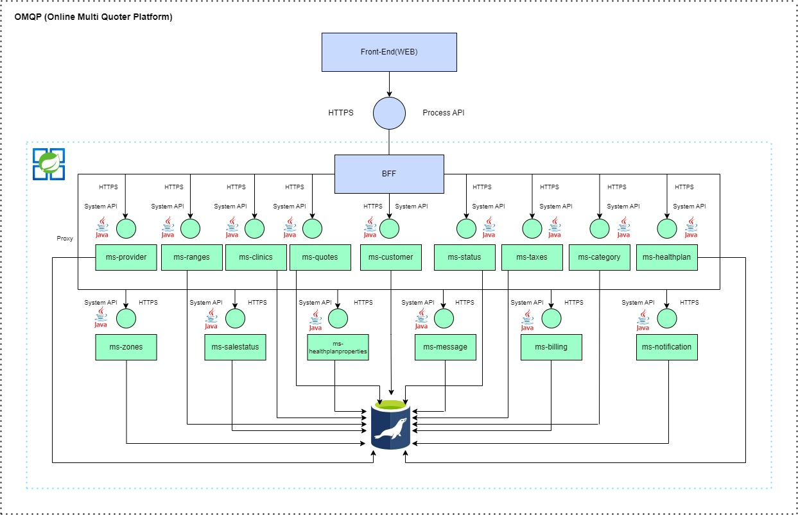
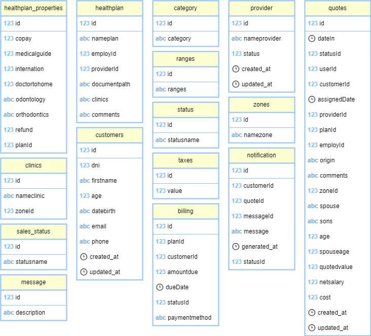

# Documento de definición de arquitectura

## 1. Pautas para la entrega del trabajo práctico final

### a) Se entrega:
#### a. Proyecto completo de Netbeans comprimido en .zip.
#### b. Archivo compilado (.jar) para ejecutar.
#### c. Proyecto Postman con los servicios configurados.
#### d. Proyecto JMeter con las pruebas ejecutadas.
#### e. Documento o capturas que muestren las pruebas de rendimiento realizadas.
#### La entrega debe estar en una carpeta llamada nombreAlumno_sistemasactivos.zip y luego cargada a la tarea asignada en Classroom.
### b) El plazo de entrega es hasta el 17/01/24 23:59 hrs.
### c) Los microservicios deben ser construidos en Java Springboot.
### d) Debe implementarse todo lo visto en clase (incluido el paginado) y agregar toda lógica que se considere necesaria para obtener un producto con la mejor terminación.
### e) Es opcional el manejo de excepciones como fue mostrado en clase.
### f) La base de datos a utlizar debe ser MySQL o MariaDB. El nombre del schema debe ser: quotes.
### g) Cada microservicio deberá contar con la documentación correspondiente (Swagger de Open API OAS3).
### h) La solución debe ser gestionada con Maven.
### i) El producto debe ser entregado para un entorno producƟvo.
### j) Deberá adjuntar las pruebas de rendimiento del microservicio realizadas con JMeter.
### k) La API debe ser del tipo RESTful estándar OPEN API OAS2 o 3.
### l) Deberá usar la especificación JPA en Hibernate para la integración con la capa de datos desde la solución SpringBoot.
### m) Se deberá usar la versión de Java 17, SpringBoot 3.0.2 o 3.0.3 y Spring Framework 6.0.5
### n) Una vez terminado y probado, el proyecto debe commitearse a un repositorio privado en Github (llamado como el proyecto y agregar como colaboradores a: arydegtiar@sistemasactivos.com, Javier.camacho@sistemasactivos.com, ramiro.foschini@sistemasactivos.com y Alfredo.mazza@sistemasactivos.com, luego cargar el proyecto en la tarea asignada de Classroom y enviar el link al repositorio en un comentario privado.

## 2. Diagrama de arquitectura de la solución

### Dada la arquitectura, se solicita únicamente desarrollar los microservicios y su interfaz API en color celeste que incluye la base de datos. 

